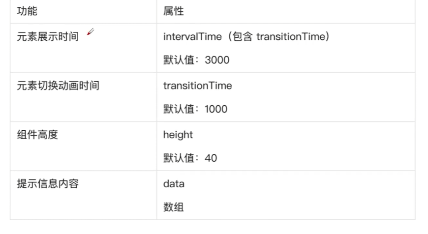

1. 二次封装Axios
2. 封装基础组件 实现组件插槽和Emit事件和自定义Props
3. 封装自定义Hooks
    1. useDebounce 防抖搜索值
    2. useAsync实现请求处理 PromiseThen和TS声明复杂数据结构
        1. 新建一个fetchHomePageData的APi
        2. 实现useAsync
    3. 二次封装实现LoadingView组件加载骨架屏 优化用户体验
4. Mockjs模拟后端数据

优化项目结构

### 6-10ScrollBar滚动提示栏

1. 计时器
2. transfromY
   

### 6-12

1. requestAnimationFrame API
    1. Webwork
2. useCountDown hook

### 6-13 Swipe轮播图开发

1. useParent和useChildren 使用 provide/inject实现跨组件通信
2. getCurrentinstance获取组件实例
3. useExpose
4. useTouch实现touch事件封装
5. useEventListener 实现事件监听
6. onMountedOrActivated封装生命周期

opSwipe 整个轮播组件
opSwipeItem 单个轮播图

autoplay
duration
loop
show-indicators 是否显示指示器
vertical 是否为纵向滚动

# 难点

mock数据返回的图片无法使用
不得已只能经过二次封装 getAssetsFile函数

requestIdleCallback懒加载路由

## useAuth

Mock JWT

- useAuth处理登陆 -> useUserStore处理信息 -> useLocalStorage保存信息
